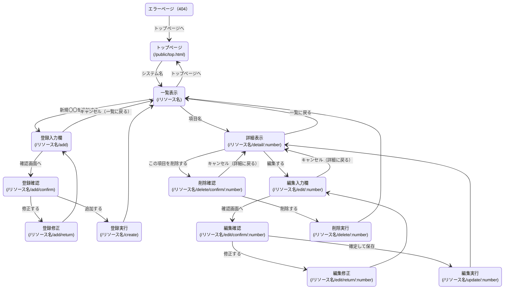

```mermaid

%%{init: {'themeVariables': { 'fontSize': '11px' }}}%%
stateDiagram-v2

    state "トップページ<br/>(/public/top.html)" as top
    state "一覧表示<br/>(/リソース名)" as menu
    state "詳細表示<br/>(/リソース名/detail/:number)" as detail

    state "登録入力欄<br/>(/リソース名/add)" as add
    state "登録確認<br/>(/リソース名/add/confirm)" as add_co
    state "登録修正<br/>(/リソース名/add/return)" as add_re
    state "登録実行<br/>(/リソース名/create)" as create

    state "編集入力欄<br/>(/リソース名/edit/:number)" as edit
    state "編集確認<br/>(/リソース名/edit/confirm/:number)" as edit_co
    state "編集修正<br/>(/リソース名/edit/return/:number)" as edit_re
    state "編集実行<br/>(/リソース名/update/:number)" as update

    state "削除確認<br/>(/リソース名/delete/confirm/:number)" as delete_co
    state "削除実行<br/>(/リソース名/delete/:number)" as delete


    エラーページ（404） --> top :トップページへ

    top --> menu :システム名
    menu --> top :トップページへ

    menu --> detail :項目名
    detail --> menu :一覧に戻る

    menu --> add :新規〇〇を追加する
    add --> menu :キャンセル（一覧に戻る）
    add --> add_co :確認画面へ
    add_co --> add_re :修正する
    add_re --> add
    add_co --> create :追加する
    create --> menu

    detail --> edit :編集する
    edit --> detail :キャンセル（詳細に戻る）
    edit --> edit_co :確認画面へ
    edit_co --> edit_re :修正する
    edit_re --> edit
    edit_co --> update :確定して保存
    update --> detail

    detail --> delete_co :この項目を削除する
    delete_co --> detail :キャンセル（詳細に戻る）
    delete_co --> delete :削除する
    delete --> menu


```